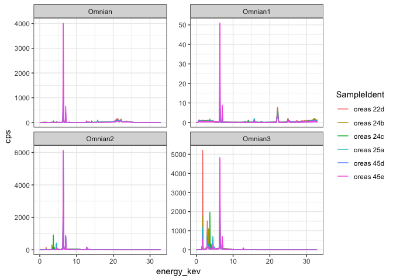

<!-- README.md is generated from README.Rmd. Please edit that file -->
xrf
===

[](https://travis-ci.org/paleolimbot/xrf)

The goal of xrf is to provide tools to read, plot, and interpret X-Ray fluorescence spectra.

Installation
------------

You can install xrf from github with:

``` r
# install.packages("devtools")
devtools::install_github("paleolimbot/xrf")
```

Example
-------

Read in a Panalytical XRF spectrum and plot it.

``` r
library(tidyverse)
library(xrf)

pan_example_dir <- system.file("spectra_files/Panalytical", package = "xrf")
pan_files <- list.files(pan_example_dir, ".mp2", full.names = TRUE)
specs <- read_xrf_panalytical(pan_files)
specs %>%
  unnest(.spectra) %>%
  ggplot(aes(x = energy_kev, y = counts, col = SampleIdent)) +
  geom_line() +
  facet_wrap(vars(ConditionSet), scales = "free_y")
```


