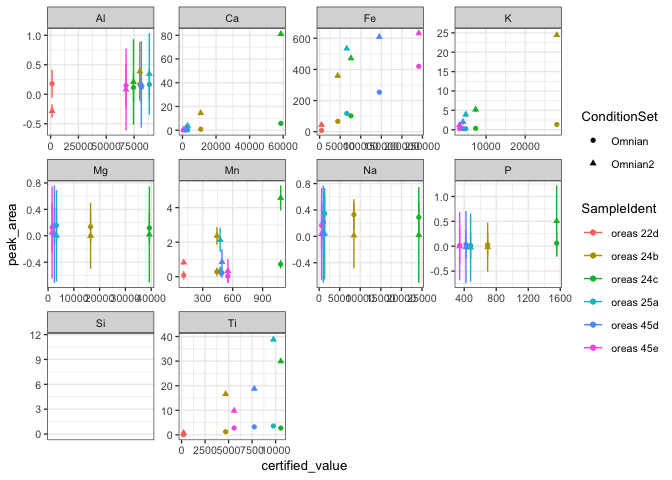
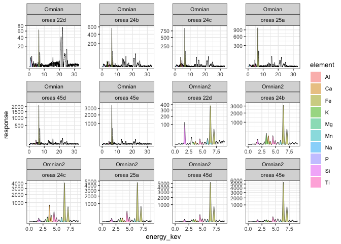

<!-- README.md is generated from README.Rmd. Please edit that file -->
xrf
===

[](https://travis-ci.org/paleolimbot/xrf) [](https://codecov.io/github/paleolimbot/xrf?branch=master)

The goal of xrf is to provide tools to read, plot, and interpret X-Ray fluorescence spectra.

Installation
------------

You can install xrf from github with:

``` r
# install.packages("devtools")
devtools::install_github("paleolimbot/xrf")
```

Example
-------

Read in a Panalytical XRF spectrum and plot it.

``` r
library(tidyverse)
library(xrf)
#> 
#> Attaching package: 'xrf'
#> The following object is masked from 'package:stats':
#> 
#>     filter

pan_example_dir <- system.file("spectra_files/Panalytical", package = "xrf")
pan_files <- list.files(pan_example_dir, ".mp2", full.names = TRUE)
specs <- read_xrf_panalytical(pan_files)
specs %>%
  xrf_despectra() %>%
  unnest(.spectra) %>%
  ggplot(aes(x = energy_kev, y = cps, col = SampleIdent)) +
  geom_line() +
  facet_wrap(vars(ConditionSet), scales = "free_y")
```


Baselines
---------

The **xrf** package can use several existing methods for estimating "background" or "baseline" values. The most useful of these for XRF spectra is the Sensitive Nonlinear Iterative Peak (SNIP) method, implemented in the **Peaks** package.

``` r
specs %>%
  slice(3) %>%
  xrf_add_baseline_snip(iterations = 20) %>%
  xrf_despectra() %>%
  unnest() %>%
  filter(energy_kev <= 15) %>%
  ggplot(aes(x = energy_kev)) +
  geom_line(aes(y = cps, col = "raw")) +
  geom_line(aes(y = baseline, col = "baseline")) +
  geom_line(aes(y = cps - baseline, col = "cps - baseline"))
#> Warning: package 'bindrcpp' was built under R version 3.4.4
```


Smoothing
---------

``` r
specs %>%
  slice(3) %>%
  xrf_add_baseline_snip(iterations = 20) %>%
  xrf_add_smooth_filter(filter = xrf_filter_gaussian(alpha = 2.5), .iter = 5) %>%
  xrf_despectra() %>%
  unnest() %>%
  filter(energy_kev <= 15) %>%
  ggplot(aes(x = energy_kev)) +
  geom_line(aes(y = cps, col = "raw"), alpha = 0.3) +
  geom_line(aes(y = smooth - baseline, col = "smooth"))
```


Deconvolution
-------------

``` r
spec_simple <- specs %>%
  slice(7) %>%
  xrf_add_baseline_snip(.values = .spectra$cps, iterations = 20) %>%
  xrf_add_smooth_filter(filter = xrf_filter_gaussian(width = 7, alpha = 2.5), .iter = 5) %>%
  pull(.spectra) %>%
  first() %>%
  filter(energy_kev <= 7.5)

rel_peaks <- xrf_energies("major", beam_energy_kev = 10) %>%
  mutate(
    jump_ratio = xrf_absorption_jump_ratio(element, edge),
    transition_prob = xrf_transition_probability(element, trans),
    yield = xrf_fluorescence_yield(element, edge),
    excitation_factor = jump_ratio * transition_prob * yield
  ) %>%
  group_by(element) %>%
  mutate(q_norm = excitation_factor / max(excitation_factor)) %>%
  ungroup() %>%
  arrange(element, desc(q_norm)) %>%
  select(element, trans, trans_siegbahn, q_norm, everything())

g <- function(x, mu = 0, sigma = 1, height = 1) height * exp(-0.5 * ((x - mu) / sigma) ^ 2)

responses_raw <- rel_peaks %>%
  mutate(response = map2(energy_kev, q_norm, ~g(spec_simple$energy_kev, mu = .x, sigma = 0.05, height = .y))) %>%
  group_by(element) %>%
  summarise(response = list(reduce(response, `+`)), energy_kev = list(spec_simple$energy_kev)) %>%
  ungroup() %>%
  mutate(
    # my guesses at making the things line up right
    scale = unname(c(
      "Al" = 10, "Ca" = 80, "Fe" = 5000, 
      "K" = 50, "Mg" = 5, "Mn" = 40, 
      "Na" = 5, "P" = 5, "Si"= 90, "Ti" = 420
    )[element])
  ) 

# least squares estimation of coefficients
# Allowing an intercept doesn't work well...produces lots of negative coeffs
# intercept <- rep(1, length(spec_simple$energy_kev))
X <- do.call(cbind, responses_raw$response)
colnames(X) <- responses_raw$element
df <- as_tibble(cbind(response = spec_simple$smooth - spec_simple$baseline, X))
fit <- lm(response ~ 0 + ., data = df)

responses_raw$scale_least_sq <- coefficients(fit)

responses <- responses_raw %>%
  unnest(response, energy_kev)

ggplot(spec_simple, aes(energy_kev, smooth - baseline)) +
  geom_line(aes(y = cps), alpha = 0.2) +
  geom_line() +
  geom_line(aes(y = response * scale_least_sq, col = element), data = responses) +
  geom_hline(yintercept = 0, alpha = 0.2) +
  stat_xrf_peaks(epsilon = 5, nudge_y = 20, element_list = "major") +
  scale_y_sqrt()
```



``` r
spec_simple2 <- specs %>%
  slice(5) %>%
  xrf_add_baseline_snip(.values = .spectra$cps, iterations = 15) %>%
  xrf_add_smooth_filter(filter = xrf_filter_gaussian(width = 7, alpha = 2.5), .iter = 10) %>%
  pull(.spectra) %>%
  first() %>%
  filter(energy_kev < 20, energy_kev > 5)

rel_peaks <- xrf_energies(c("Pb", "As", "Cu", "Rb", "Zr", "Sr", "Fe"), beam_energy_kev = 20) %>%
  mutate(
    jump_ratio = xrf_absorption_jump_ratio(element, edge),
    transition_prob = xrf_transition_probability(element, trans),
    yield = xrf_fluorescence_yield(element, edge),
    excitation_factor = jump_ratio * transition_prob * yield
  ) %>%
  group_by(element) %>%
  mutate(q_norm = excitation_factor / max(excitation_factor)) %>%
  ungroup() %>%
  arrange(element, desc(q_norm)) %>%
  select(element, trans, trans_siegbahn, q_norm, everything())

g <- function(x, mu = 0, sigma = 1, height = 1) height * exp(-0.5 * ((x - mu) / sigma) ^ 2)

responses <- rel_peaks %>%
  mutate(response = map2(energy_kev, q_norm, ~g(spec_simple2$energy_kev, mu = .x, sigma = 0.08, height = .y))) %>%
  group_by(element) %>%
  summarise(response = list(reduce(response, `+`)), energy_kev = list(spec_simple2$energy_kev)) %>%
  ungroup() %>%
  mutate(
    scale = c("Pb" = 3, "As" = 1, "Cu" = 2, "Rb" = 25, "Zr" = 90, "Sr" = 8, "Fe" = 1200)[element]
  ) %>%
  unnest(response, energy_kev)

ggplot(spec_simple2, aes(energy_kev, smooth - baseline)) +
  geom_line(aes(y = cps), alpha = 0.2) +
  geom_line() +
  geom_line(aes(y = response * scale, col = element), data = responses) +
  geom_hline(yintercept = 0, alpha = 0.2) +
  stat_xrf_peaks(element_list = c("Pb", "As", "Cu", "Rb", "Zr", "Sr", "Fe"), nudge_y = 20) +
  scale_y_sqrt()
```



Peaks
-----

$$
y(i)=∑\_{j=1}^{n}h(i-j)x(j)+e(i)
$$

*x*<sup>(*k*)</sup>(*i*)=*M*<sup>(*k*)</sup>(*i*)*x*<sup>(*k* − 1)</sup>(*i*)

``` r
spec <- specs %>%
  slice(7) %>%
  xrf_add_baseline_snip(iterations = 20) %>%
  xrf_add_smooth_filter(filter = xrf_filter_gaussian(alpha = 2.5), .iter = 5) %>%
  pull(.spectra) %>%
  first()

sigma_index <- 6
energy_kev <- spec$energy_kev
values <- spec$fit - spec$background
energy_res <- mean(diff(energy_kev))

search <- Peaks::SpectrumSearch(values, threshold = 0.01, sigma = sigma_index)

g <- function(x, mu = 0, sigma = 1, height = 1) height * exp(-0.5 * ((x - mu) / sigma) ^ 2)

tbl <- tibble::tibble(
  peak_index = search$pos,
  peak_energy_kev = energy_kev[peak_index], 
  peak_sigma = sigma_index * energy_res,
  peak_height = values[peak_index],
  peak_area = peak_height * peak_sigma * sqrt(2 * pi)
)

peak_response = pmap(list(mu = tbl$peak_energy_kev, sigma = tbl$peak_sigma, height = tbl$peak_height), g, energy_kev)
spec$deconv <- do.call(cbind, peak_response) %>%
  rowSums()
spec$deconv2 <- search$y

ggplot(spec, aes(energy_kev)) +
  geom_line(aes(y = fit - background, col = "original")) +
  geom_line(aes(y = deconv, col = "deconv")) +
  xlim(0, 10) +
  stat_xrf_peaks(aes(y = fit - background), epsilon = 10)
```

``` r
oreas22d <- specs %>%
  filter(SampleIdent == "oreas 22d") %>%
  unnest(.spectra) %>%
  mutate(cps = counts / LiveTime)

xrf_en <- x_ray_xrf_energies %>%
  crossing(tibble(ConditionSet = unique(oreas22d$ConditionSet))) %>%
  group_by(ConditionSet) %>%
  mutate(
    data = list(oreas22d[oreas22d$ConditionSet == ConditionSet[1],]),
    counts = approx(data[[1]]$energy_kev, data[[1]]$counts, energy_kev)$y,
    fit = approx(data[[1]]$energy_kev, data[[1]]$fit, energy_kev)$y,
    background = approx(data[[1]]$energy_kev, data[[1]]$background, energy_kev)$y,
    cps = approx(data[[1]]$energy_kev, data[[1]]$cps, energy_kev)$y
  ) %>%
  select(-data)

library(plotly)
plot_ly() %>%
  add_lines(x = ~energy_kev, y = ~cps, color = ~ConditionSet, hoverinfo = "none", 
            data = oreas22d) %>%
  add_markers(x = ~energy_kev, y = ~cps, text = ~element, color = ~ConditionSet, data = xrf_en)
```
