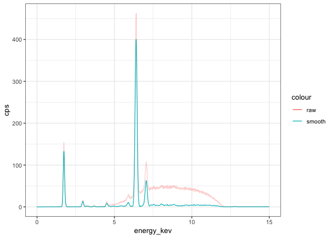

<!-- README.md is generated from README.Rmd. Please edit that file -->
xrf
===

[](https://travis-ci.org/paleolimbot/xrf)

The goal of xrf is to provide tools to read, plot, and interpret X-Ray fluorescence spectra.

Installation
------------

You can install xrf from github with:

``` r
# install.packages("devtools")
devtools::install_github("paleolimbot/xrf")
```

Example
-------

Read in a Panalytical XRF spectrum and plot it.

``` r
library(tidyverse)
library(xrf)

pan_example_dir <- system.file("spectra_files/Panalytical", package = "xrf")
pan_files <- list.files(pan_example_dir, ".mp2", full.names = TRUE)
specs <- read_xrf_panalytical(pan_files)
specs %>%
  unnest(.spectra) %>%
  ggplot(aes(x = energy_kev, y = cps, col = SampleIdent)) +
  geom_line() +
  facet_wrap(vars(ConditionSet), scales = "free_y")
```


Baselines
---------

The **xrf** package can use several existing methods for estimating "background" or "baseline" values. The most useful of these for XRF spectra is the Sensitive Nonlinear Iterative Peak (SNIP) method, implemented in the **Peaks** package.

``` r
specs %>%
  slice(3) %>%
  xrf_add_baseline_snip(iterations = 20) %>%
  unnest() %>%
  filter(energy_kev <= 15) %>%
  ggplot(aes(x = energy_kev)) +
  geom_line(aes(y = cps, col = "raw")) +
  geom_line(aes(y = baseline, col = "baseline")) +
  geom_line(aes(y = cps - baseline, col = "cps - baseline"))
#> Warning: package 'bindrcpp' was built under R version 3.4.4
```


Smoothing
---------

``` r
specs %>%
  slice(3) %>%
  xrf_add_baseline_snip(iterations = 20) %>%
  xrf_add_smooth_gaussian() %>%
  unnest() %>%
  filter(energy_kev <= 15) %>%
  ggplot(aes(x = energy_kev)) +
  geom_line(aes(y = cps, col = "raw"), alpha = 0.3) +
  geom_line(aes(y = smooth - baseline, col = "smooth"))
```



Peaks
-----

``` r
energy_kev <- specs$.spectra[[1]]$energy_kev
spec <- specs$.spectra[[1]]$fit
peaks <- Peaks::SpectrumSearch(spec, background = TRUE, iterations = 15, threshold = .5)
ggplot(tibble(energy_kev, spec, deconv = peaks$y), aes(energy_kev)) +
  geom_line(aes(y = spec, col = "original")) +
  geom_line(aes(y = deconv, col = "deconv")) +
  geom_vline(xintercept = energy_kev[peaks$pos], alpha = 0.2, col = "red") +
  scale_y_sqrt()
```

``` r
oreas22d <- specs %>%
  filter(SampleIdent == "oreas 22d") %>%
  unnest(.spectra) %>%
  mutate(cps = counts / LiveTime)

xrf_en <- xrf_energies %>%
  crossing(tibble(ConditionSet = unique(oreas22d$ConditionSet))) %>%
  group_by(ConditionSet) %>%
  mutate(
    data = list(oreas22d[oreas22d$ConditionSet == ConditionSet[1],]),
    counts = approx(data[[1]]$energy_kev, data[[1]]$counts, energy_kev)$y,
    fit = approx(data[[1]]$energy_kev, data[[1]]$fit, energy_kev)$y,
    background = approx(data[[1]]$energy_kev, data[[1]]$background, energy_kev)$y,
    cps = approx(data[[1]]$energy_kev, data[[1]]$cps, energy_kev)$y
  ) %>%
  select(-data)

library(plotly)
plot_ly() %>%
  add_lines(x = ~energy_kev, y = ~cps, color = ~ConditionSet, hoverinfo = "none", 
            data = oreas22d) %>%
  add_markers(x = ~energy_kev, y = ~cps, text = ~element, color = ~ConditionSet, data = xrf_en)
```
